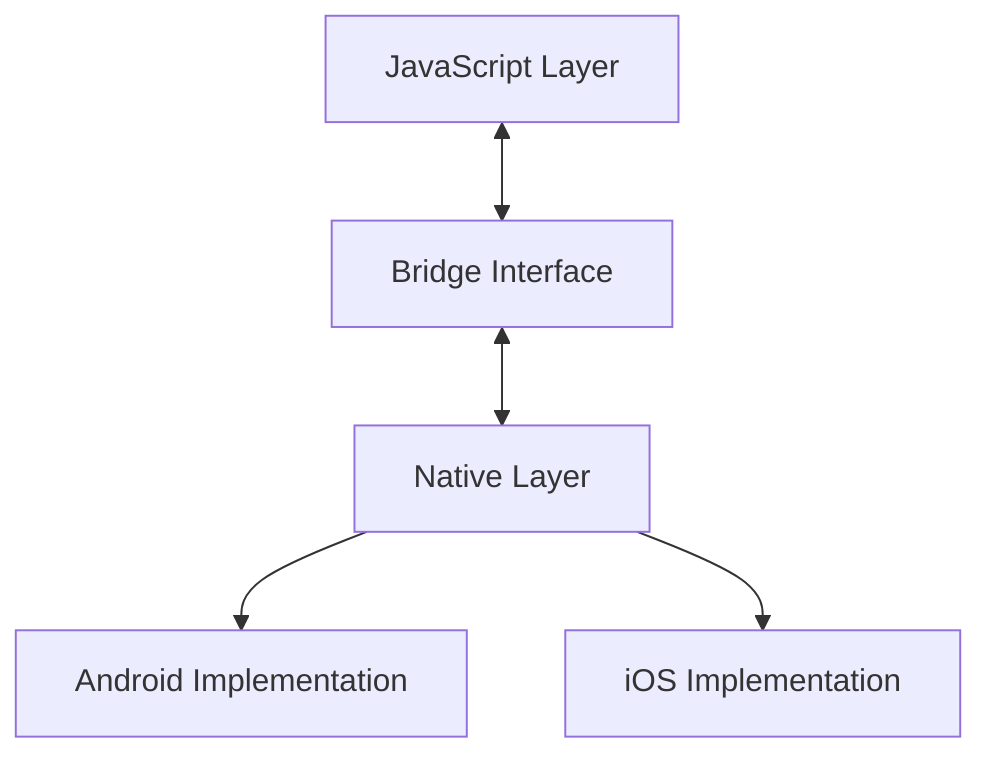

# WebView Communication Architecture Overview

## Introduction

This guide provides a comprehensive implementation of bidirectional communication between WebView JavaScript and native platforms (Android/iOS). The architecture enables seamless data transfer, file handling, and secure communication between web and native components.

## Architecture

## Core Components

### 1. JavaScript Layer
- Handles web-side communication
- Manages data serialization
- Provides event-based interface
- Implements error handling

### 2. Bridge Interface
- Facilitates bidirectional communication
- Ensures type safety
- Manages message queuing
- Handles protocol consistency

### 3. Native Layer
- Processes JavaScript requests
- Manages native operations
- Handles file system access
- Implements security measures

## Communication Flow

1. **JavaScript to Native**
   - Event triggered in JavaScript
   - Data serialized to JSON
   - Message passed through bridge
   - Native handler processes request

2. **Native to JavaScript**
   - Native event triggered
   - Data prepared and validated
   - Message passed through bridge
   - JavaScript handler processes data

## Key Features

- **Type Safety**: Full TypeScript support
- **Error Handling**: Comprehensive error management
- **Security**: Built-in security measures
- **Performance**: Optimized data transfer
- **File Handling**: Robust file operations

## Implementation Guidelines

1. **Setup Requirements**
   - WebView configuration
   - Bridge interface setup
   - Event handler registration
   - Security configuration

2. **Best Practices**
   - Validate all data transfers
   - Implement proper error handling
   - Follow security guidelines
   - Optimize performance

3. **Security Considerations**
   - Input validation
   - Data sanitization
   - Permission management
   - Secure file handling

## Next Steps

- [Setup Guide](setup.md)
- [JavaScript to Native Communication](js-to-native.md)
- [Native to JavaScript Communication](native-to-js.md)
- [File Handling](file-handling.md)
